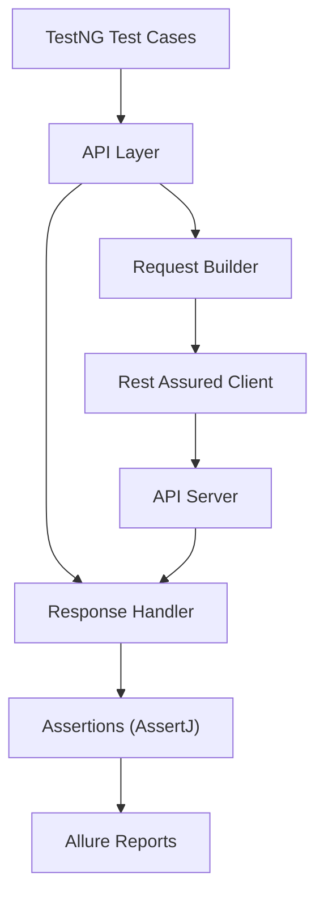
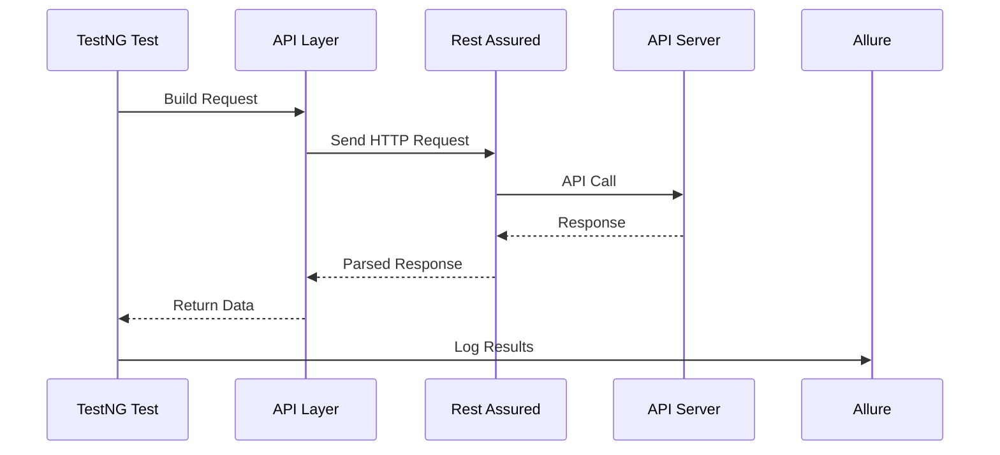
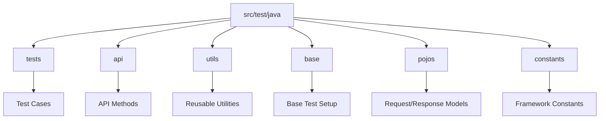
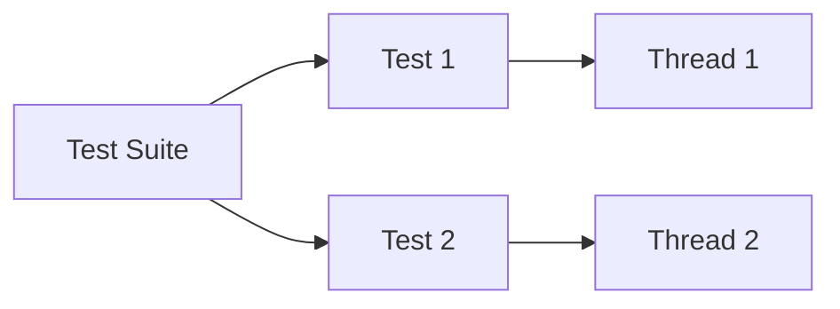
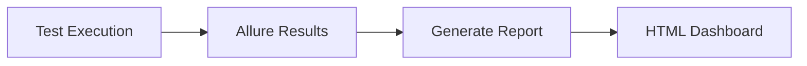
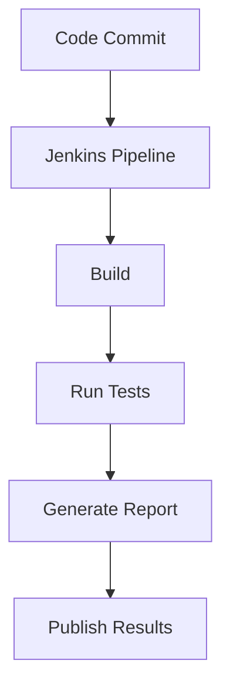

# 🚀 API Automation Framework – Rest Assured (Java)

### ✍️ Author: Prrammod Dutta

A robust **API Automation Framework** built using **Rest Assured** for testing the CRUD operations of the **Restful Booker API**. This framework follows a **hybrid design pattern**, integrates CI/CD pipelines, and generates rich **Allure Reports**.

---

## 📌 Table of Contents

* [Overview](#-overview)
* [Tech Stack](#-tech-stack)
* [Architecture](#-architecture)
* [Framework Flow](#-framework-flow)
* [Project Structure](#-project-structure)
* [Setup & Execution](#-setup--execution)
* [MySQL DB Integration](#-mysql-db-integration)
* [Parallel Execution](#-parallel-execution)
* [Integration Tests](#-integration-tests)
* [Allure Reporting](#-allure-reporting)
* [CI/CD Integration](#-cicd-integration)
* [Test Scenarios](#-test-scenarios)
* [Best Practices](#-best-practices)

---

## 📖 Overview

This framework is designed to:

* Automate **CRUD operations** of REST APIs
* Provide **scalable and maintainable test architecture**
* Support **parallel execution**
* Integrate with **CI/CD pipelines**
* Generate **detailed reports with Allure**

---

## 🛠 Tech Stack

* ☕ Java (JDK > 23)
* 🔗 Rest Assured
* 🧪 TestNG
* 📦 Maven
* 📊 Apache POI (for test data)
* 🔍 AssertJ (advanced assertions)
* 🔄 Jackson API & GSON (JSON parsing)
* 🪵 Log4j (logging)
* 📈 Allure Reports
* 🗄 MySQL Connector/J
* ⚙️ Jenkins (CI/CD)

---

## 🏗 Architecture

The framework follows a **Hybrid Framework Design** combining:

* Page Object Model (API abstraction)
* Data-driven testing
* Utility-based reusable components

---

## 🔄 Framework Flow



---

## 📁 Project Structure



---

## ⚙️ Setup & Execution

### 🔹 Prerequisites

* Install Java (JDK 23+)
* Install Maven

### 🔹 Run Tests

```bash
mvn test -Dsurefire.suiteXmlFiles=testng.xml
```

### 🔹 Add Maven Surefire Plugin

```xml
<build>
  <plugins>
    <plugin>
      <groupId>org.apache.maven.plugins</groupId>
      <artifactId>maven-surefire-plugin</artifactId>
      <version>3.3.0</version>
      <configuration>
        <suiteXmlFiles>
          <suiteXmlFile>${suiteXmlFile}</suiteXmlFile>
        </suiteXmlFiles>
      </configuration>
    </plugin>
  </plugins>
</build>
```

---

## 🗄 MySQL DB Integration

Use this when you want to validate API data against MySQL or seed/clean test data before a test run.

### 🔹 1. Install MySQL

Choose one of these options:

* macOS (Homebrew)

```bash
brew install mysql
brew services start mysql
```

* Windows / Linux
  Download and install MySQL Community Server from the official MySQL installer for your OS, then start the MySQL service.

### 🔹 2. Create a Database and Test User

```sql
CREATE DATABASE api_automation;
CREATE USER 'api_user'@'localhost' IDENTIFIED BY 'StrongPassword123';
GRANT ALL PRIVILEGES ON api_automation.* TO 'api_user'@'localhost';
FLUSH PRIVILEGES;
```

If your team already has a MySQL database, you can skip the creation step and just use the existing host, port, database, username, and password.

### 🔹 3. Configure Environment Variables

Add the DB values to your local `.env` file or pass them as JVM system properties:

```env
MYSQL_HOST=localhost
MYSQL_PORT=3306
MYSQL_DATABASE=api_automation
MYSQL_USERNAME=api_user
MYSQL_PASSWORD=StrongPassword123
MYSQL_JDBC_PARAMS=useSSL=false&allowPublicKeyRetrieval=true&serverTimezone=UTC
```

### 🔹 4. MySQL Connector Dependency

The framework now includes the MySQL JDBC driver in `pom.xml`. If dependencies are not downloaded yet, run:

```bash
mvn clean compile
```

### 🔹 5. Utility Added for Direct DB Access

Reusable utility:

`src/main/java/com/thetestingacademy/utils/MySqlDBConnector.java`

What it supports:

* Create a DB connection from `.env` values
* Build the JDBC URL automatically
* Validate the connection
* Run `SELECT` queries and get rows as `List<Map<String, Object>>`
* Run `INSERT`, `UPDATE`, and `DELETE` statements

### 🔹 6. Example Usage in API Automation

```java
import com.thetestingacademy.utils.MySqlDBConnector;

import java.sql.Connection;
import java.util.List;
import java.util.Map;

public class BookingDbValidationExample {

    public void validateBookingFromDb(int bookingId) {
        try (Connection connection = MySqlDBConnector.getConnection()) {
            List<Map<String, Object>> rows = MySqlDBConnector.executeSelect(
                    connection,
                    "SELECT booking_id, firstname, lastname FROM booking WHERE booking_id = ?",
                    bookingId
            );

            if (rows.isEmpty()) {
                throw new AssertionError("Booking record not found in MySQL for booking id: " + bookingId);
            }

            System.out.println(rows.get(0));
        } catch (Exception e) {
            throw new RuntimeException("DB validation failed", e);
        }
    }
}
```

### 🔹 7. Common Usage Ideas

* Verify API response data against MySQL records
* Insert test data before execution
* Clean up DB records after test completion
* Validate audit/event rows created by an API call

---

## ⚡ Parallel Execution

Run tests in parallel using TestNG:

```xml
<suite name="All Test Suite" parallel="methods" thread-count="2">
```

### Execution Flow



---

## 🔗 Integration Tests

Run full integration suite:

```bash
mvn clean test -DsuiteXmlFile=testng-integration.xml
```

### Covered Scenarios:

* Create Booking
* Generate Token
* Update Booking
* Delete Booking
* Validate End-to-End Flow

---

## 📊 Allure Reporting

### 🔹 Install Allure

```bash
brew install allure
```

### 🔹 Add Dependency

```xml
<dependency>
    <groupId>io.qameta.allure</groupId>
    <artifactId>allure-testng</artifactId>
    <version>2.13.0</version>
</dependency>
```

### 🔹 Add Plugin

```xml
<plugin>
    <groupId>io.qameta.allure</groupId>
    <artifactId>allure-maven</artifactId>
    <version>2.10.0</version>
</plugin>
```

### 🔹 Generate Report

```bash
mvn clean test
allure generate target/allure-results --clean -o allure-report
allure open allure-report
```

### Reporting Flow



---

## 🔁 CI/CD Integration

This framework supports Jenkins pipeline execution.



---

## 🧪 Test Scenarios

### ✅ CRUD Operations

1. Create Booking → Update → Verify
2. Create Booking → Delete → Verify عدم existence
3. Get Booking → Update → Validate
4. Create → Delete Flow
5. Invalid Payload Testing
6. Update Deleted Resource

---

### 📬 Postman Assignments

* Create Collections for:

    * RESTful Booker CRUD
    * Add test scripts
    * Integration scenarios

---

### 🔍 Validation Checks

* ✅ Response Body
* ✅ Status Code
* ✅ Headers

---

## 🧠 Best Practices

* Use **POJOs for request/response modeling**
* Keep **test data separate**
* Use **centralized configuration**
* Implement **logging for debugging**
* Add **assertion layers**
* Maintain **clean folder structure**

---

## 📸 Screenshots

### Test Execution


### CI/CD Pipeline


### Allure Report


---

## 🎯 Conclusion

This framework provides a **scalable, maintainable, and production-ready solution** for API automation with:

* Clean architecture
* Powerful reporting
* CI/CD readiness
* Extensibility for future enhancements

---

If you want, I can also:

* Add badges (build status, coverage)
* Improve GitHub UI sections
* Add sample test cases or code snippets
* Convert this into a portfolio-ready project README
